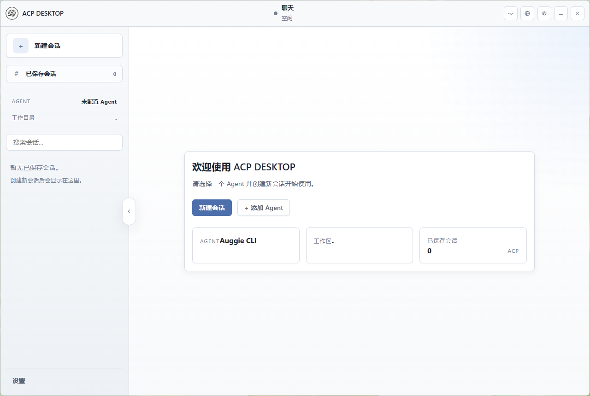
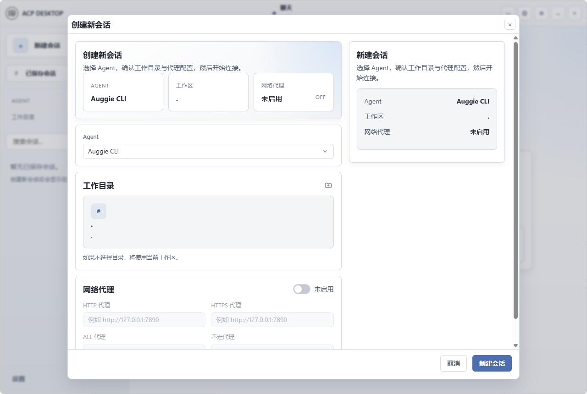
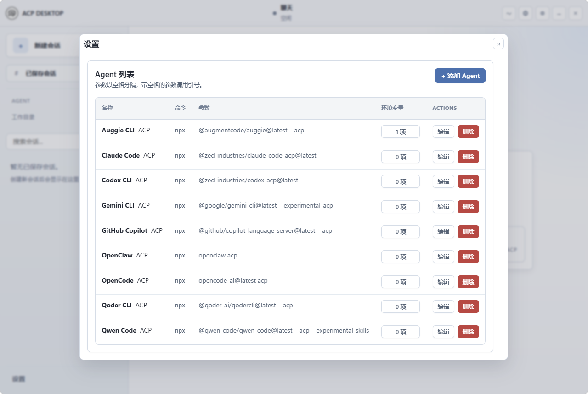
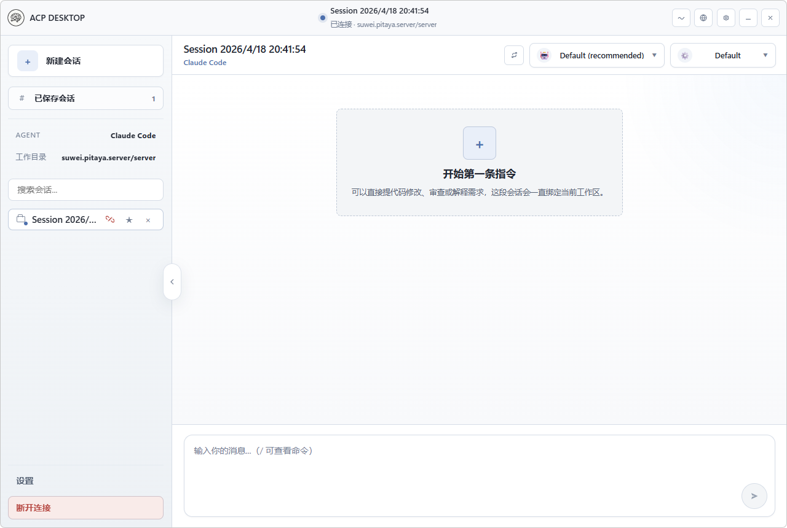
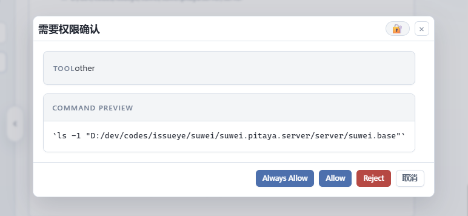
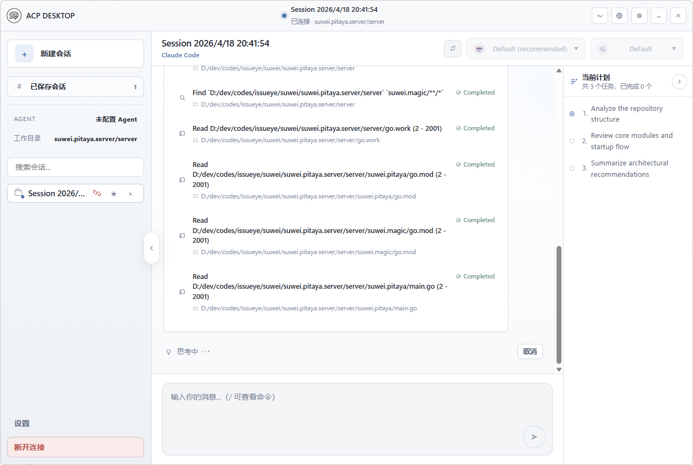

# ACP DESKTOP

<p align="center">
  
</p>

ACP DESKTOP 是一个基于 Wails 的桌面端 ACP 客户端，用于连接和管理兼容 ACP 协议的智能体。项目后端使用 Go，前端使用 Vue 3，提供会话管理、多 Agent 切换、聊天交互、工具调用展示、任务计划追踪、本地文件读写以及托盘等桌面端能力。

[English](./README_en.md)

## 界面预览

### 首页

首页提供清晰的启动入口，可以快速创建新会话、查看已保存会话、确认当前 Agent 和工作目录状态。



### 创建新会话

新建会话弹窗集中展示 Agent、工作目录和网络代理配置，并在右侧提供会话摘要，便于启动前确认连接信息。



### Agent 设置

设置页支持管理 Agent 列表，包括命令、参数、环境变量数量以及编辑/删除操作，适合维护多种 ACP Agent 启动方式。



### 聊天窗口

聊天窗口提供会话标题、Agent 信息、模型/模式选择、刷新当前会话、命令提示和底部输入框，适合持续进行代码分析、修改和问答。



### 权限确认

当 Agent 需要执行敏感工具或访问本地资源时，应用会弹出权限确认窗口，展示工具名称、目标路径和可选操作，便于在执行前进行人工确认。



### 任务与工具调用

任务面板在聊天窗口右侧展示当前计划，工具调用以简洁列表呈现执行状态，方便观察 Agent 的分析、读取、执行和总结过程。



## 技术栈

- 后端：Go 1.22+ / Wails v2
- 前端：Vue 3、Vite、Pinia
- 桌面壳：Wails 无边框窗口
- 协议 SDK：`@agentclientprotocol/sdk`

## 主要功能

- Agent 管理：通过可编辑配置维护多个 ACP Agent，支持命令、参数和环境变量。
- 会话管理：支持创建、恢复、刷新、断开会话，并在左侧栏展示已保存会话。
- 聊天交互：支持普通消息、命令提示、模型选择和模式选择。
- 工具渲染：展示工具调用名称、路径、状态和长内容展开/收起。
- 权限确认：敏感工具执行前弹出确认窗口，展示工具信息和目标路径。
- 任务计划：右侧任务面板展示当前计划，支持面板收起和长任务折叠。
- 工作目录：新建会话时可选择工作目录，并在会话中持续关联。
- 网络代理：创建会话时可配置 HTTP、HTTPS、ALL_PROXY 和 NO_PROXY。
- 本地文件：通过桌面桥接支持本地文本文件读取和写入。
- 本地持久化：保存用户偏好、会话元数据和配置文件。
- 桌面能力：支持无边框窗口、隐藏到后台和 Windows 托盘菜单。

## 使用流程

1. 启动应用后，在首页选择或添加 Agent。
2. 点击“新建会话”，确认 Agent、工作目录和代理配置。
3. 创建会话后进入聊天窗口，输入问题或通过 `/` 查看可用命令。
4. 在执行过程中查看工具调用、思考状态和右侧当前任务。
5. 会话结束后可断开连接，后续从左侧已保存会话中恢复。

## 项目结构

```text
.
|- app/                Wails 应用入口和平台托盘集成
|- assets/             应用级静态资源
|- docs/               项目文档
|- frontend/           Vue 3 + Vite 前端
|  |- src/
|  |- public/
|- internal/
|  |- agent/           Agent 进程生命周期管理
|  |- config/          Agent 配置加载、保存和热更新
|  |- store/           本地 JSON 存储管理
|  |- system/          版本和机器信息辅助能力
|- main.go             Wails 启动入口
|- wails.json          Wails 开发和构建配置
```

## 环境要求

- Go 1.22 或更高版本
- Node.js 18+ 和 npm
- Wails CLI

安装 Wails CLI：

```bash
go install github.com/wailsapp/wails/v2/cmd/wails@latest
```

## 安装依赖

安装前端依赖：

```bash
cd frontend
npm install
```

## 开发运行

启动完整桌面应用：

```bash
wails dev
```

也可以从前端目录启动：

```bash
cd frontend
npm run wails:dev
```

如果只需要运行前端开发服务器：

```bash
cd frontend
npm run dev
```

## 构建

构建前端资源：

```bash
cd frontend
npm run build
```

构建桌面应用：

```bash
wails build
```

也可以从前端目录执行：

```bash
cd frontend
npm run wails:build
```

单独验证 Go 侧构建：

```bash
go build ./...
```

## Agent 配置

应用会把 Agent 配置保存到用户配置目录：

```text
<UserConfigDir>/acp_desktop/agents.json
```

Windows 下通常类似：

```text
%AppData%/acp_desktop/agents.json
```

首次启动时会自动初始化默认 Agent。配置文件结构示例：

```json
{
  "agents": {
    "Claude Code": {
      "command": "npx",
      "args": ["@zed-industries/claude-code-acp@latest"],
      "env": {}
    }
  }
}
```

应用会监听该配置文件变化，并自动重新加载。

## 本地存储

用户偏好和会话相关数据会保存到：

```text
<UserConfigDir>/acp_desktop/stores/
```

## 桌面端行为

- 无边框窗口
- 关闭窗口时默认隐藏到后台
- Windows 托盘支持显示窗口、隐藏窗口和退出应用
- 前端生产资源会从 `frontend/dist` 嵌入到 Go 二进制中

## 常用命令

```bash
cd frontend && npm run build
go build ./...
wails dev
wails build
```

## 致谢

感谢 [formulahendry/acp-ui](https://github.com/formulahendry/acp-ui) 项目为 ACP 桌面客户端的产品形态和功能设计提供参考与启发。

## 备注

- 应用标题为 `ACP DESKTOP`。
- 主文档优先使用中文。
- 英文文档见 [README_en.md](./README_en.md)。
