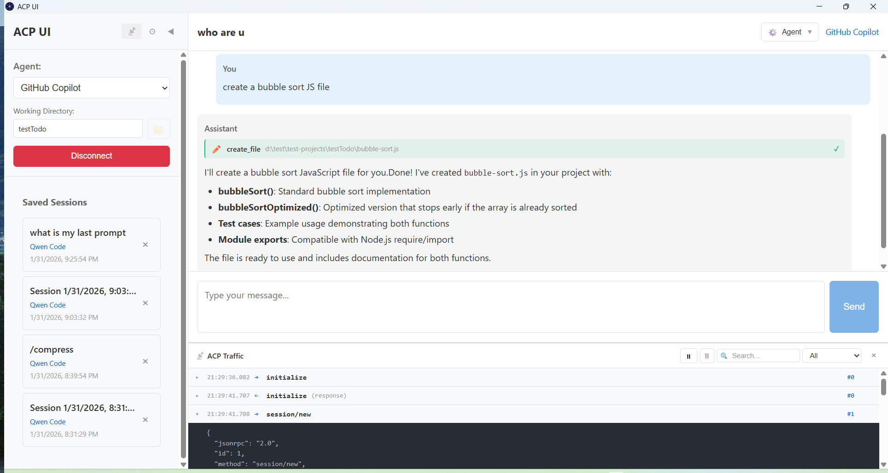

# ACP UI

<a href="https://apps.microsoft.com/detail/9P76NGS1VF2L?referrer=appbadge&mode=full" target="_blank"  rel="noopener noreferrer">
	
</a>

A modern, cross-platform desktop client for the [Agent Client Protocol (ACP)](https://agentclientprotocol.com/). Connect to AI coding agents like GitHub Copilot, Claude Code, Gemini CLI, Qwen Code, Codex CLI, OpenCode, OpenClaw, and any ACP-compatible agent from a unified interface.



## 📥 Installation

Download the latest release for your platform from [GitHub Releases](https://github.com/formulahendry/acp-ui/releases):

| Platform | Download |
|----------|----------|
| **Windows** | [.msi installer](https://github.com/formulahendry/acp-ui/releases/latest) or [.exe (NSIS)](https://github.com/formulahendry/acp-ui/releases/latest) |
| **macOS (Apple Silicon)** | [.dmg (ARM64)](https://github.com/formulahendry/acp-ui/releases/latest) |
| **macOS (Intel)** | [.dmg (x64)](https://github.com/formulahendry/acp-ui/releases/latest) |
| **Linux (x64)** | [.deb](https://github.com/formulahendry/acp-ui/releases/latest) or [.AppImage](https://github.com/formulahendry/acp-ui/releases/latest) or [.rpm](https://github.com/formulahendry/acp-ui/releases/latest) |
| **Linux (ARM64)** | [.deb](https://github.com/formulahendry/acp-ui/releases/latest) or [.AppImage](https://github.com/formulahendry/acp-ui/releases/latest) or [.rpm](https://github.com/formulahendry/acp-ui/releases/latest) |

## ✨ Features

- **Multi-Agent Support** — Connect to any ACP-compatible agent
- **Session Management** — Create, resume, and manage conversation sessions
- **Rich Chat Interface** — Markdown rendering, syntax highlighting, tool call visualization
- **Slash Commands** — Quick access to agent capabilities with `/command` syntax
- **Permission Controls** — Approve or deny agent actions before execution
- **Session Modes** — Switch between agent modes (ask, code, architect, etc.)
- **Model Picker** — Select from available AI models (unstable API)
- **Agent Thinking** — View the agent's reasoning process (collapsible)
- **Environment Variables** — Configure per-agent environment variables (API keys, settings)
- **Traffic Monitor** — Debug and inspect ACP protocol messages in real-time
- **Hot-Reload Config** — Edit agent configurations without restarting
- **Cross-Platform** — Windows, macOS (ARM/Intel), Linux (x64/ARM64)

## 🎯 Default Agents

ACP UI comes pre-configured with these agents:

| Agent | Package |
|-------|---------|
| [GitHub Copilot](https://github.com/github/copilot-language-server-release?tab=readme-ov-file#agent-client-protocol-acp-preview) | `@github/copilot-language-server` |
| [Claude Code](https://github.com/zed-industries/claude-code-acp) | `@zed-industries/claude-code-acp` |
| [Gemini CLI](https://github.com/google-gemini/gemini-cli) | `@google/gemini-cli` |
| [Qwen Code](https://github.com/QwenLM/qwen-code) | `@qwen-code/qwen-code` |
| [Auggie CLI](https://github.com/AugmentCode/auggie) | `@augmentcode/auggie` |
| [Qoder CLI](https://github.com/qoder-ai/qodercli) | `@qoder-ai/qodercli` |
| [Codex CLI](https://github.com/zed-industries/codex-acp) | `@zed-industries/codex-acp` |
| [OpenCode](https://github.com/opencode-ai/opencode) | `opencode-ai` |
| [OpenClaw](https://github.com/nicobailon/openclaw) | `openclaw` |

## 🛠️ Configuration

Agent configurations are stored in:

| Platform | Path |
|----------|------|
| Windows | `%APPDATA%\acp-ui\agents.json` |
| macOS | `~/Library/Application Support/acp-ui/agents.json` |
| Linux | `~/.config/acp-ui/agents.json` |

### Example Configuration

```json
{
  "agents": {
    "GitHub Copilot": {
      "command": "npx",
      "args": ["@github/copilot-language-server@latest", "--acp"],
      "env": {}
    },
    "Claude Code": {
      "command": "npx",
      "args": ["@zed-industries/claude-code-acp@latest"],
      "env": {
        "ANTHROPIC_API_KEY": "sk-ant-..."
      }
    },
    "Gemini CLI": {
      "command": "npx",
      "args": ["@google/gemini-cli@latest", "--experimental-acp"],
      "env": {}
    },
    "Qwen Code": {
      "command": "npx",
      "args": ["@qwen-code/qwen-code@latest", "--acp", "--experimental-skills"],
      "env": {}
    },
    "Auggie CLI": {
      "command": "npx",
      "args": ["@augmentcode/auggie@latest", "--acp"],
      "env": {"AUGMENT_DISABLE_AUTO_UPDATE": "1"}
    },
    "Qoder CLI": {
      "command": "npx",
      "args": ["@qoder-ai/qodercli@latest", "--acp"],
      "env": {}
    },
    "Codex CLI": {
      "command": "npx",
      "args": ["@zed-industries/codex-acp@latest"],
      "env": {}
    },
    "OpenCode": {
      "command": "npx",
      "args": ["opencode-ai@latest", "acp"],
      "env": {}
    },
    "OpenClaw": {
      "command": "npx",
      "args": ["openclaw", "acp"],
      "env": {}
    }
  }
}
```

> **Note**: Environment variables are passed to the agent process on startup. Use these for API keys, custom settings, or overriding default behavior.

## 📖 Usage

1. **Select an Agent** — Choose from the dropdown in the sidebar
2. **Set Working Directory** — Click "Select Folder" to choose your project root
3. **Create Session** — Click "New Session" to start chatting
4. **Use Slash Commands** — Type `/` to see available commands
5. **Resume Sessions** — Click on saved sessions in the sidebar to resume

## 🚀 Development

### Prerequisites

- [Node.js](https://nodejs.org/) 18+
- [Go](https://go.dev/) 1.22+
- [Wails CLI](https://wails.io/docs/gettingstarted/installation)

### Setup

```bash
# Clone the repository
git clone https://github.com/formulahendry/acp-ui.git
cd acp-ui

# Install dependencies
npm install

# Run in development mode
wails dev
```

### Build for Production

```bash
wails build
```

## 🔗 Links

- [Agent Client Protocol](https://agentclientprotocol.com/)
- [Wails Documentation](https://wails.io/docs/)

## 📄 License

MIT License
